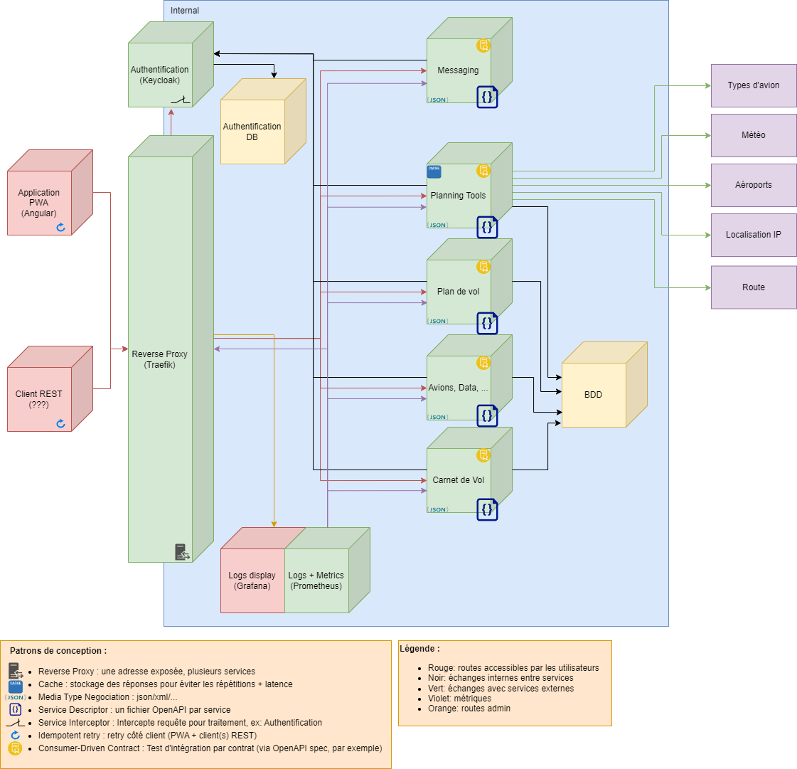
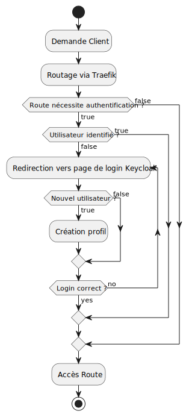

# Pilot Helper

PilotHelper permet aux aviateurs d’être accompagnés dans la préparation 
de leurs vols. Cela se traduit par une sélection d’outils de planification 
permettant par exemple la conception d’un plan de vol ou le suivi de la 
météo en temps réel sur le trajet prévu.

## Système

Voici un résumé de l'architecture du projet :



| Service                                      | Route via proxy | Fichier de spécification                                                       |
|----------------------------------------------|-----------------|--------------------------------------------------------------------------------|
| [Données avions, ...](./data)                | /data           | [OpenAPI spec](./data/src/main/resources/openapi/documentation.yaml)           |
| [Plans de vol](./flight-plan)                | /flight-plan    | [OpenAPI spec](./flight-plan/src/main/resources/openapi/documentation.yaml)    |
| [Outils de planifications](./planning-tools) | /planning-tools | [OpenAPI spec](./planning-tools/src/main/resources/openapi/documentation.yaml) |

## Setup

- Lancer le script [env-setup.sh](./env-setup.sh) pour copier les fichiers env depuis [les exemples](./documentation/env) puis les paramétrer (les valeurs par défaut suffisent pour un essai).
- Installer docker et docker compose (si ce n'est pas déjà fait)
- Ajouter dans le fichier `hosts` (`C:\Windows\System32\drivers\etc\hosts` sur Windows) la
  ligne ```127.0.0.1 pilothelper.com```.
- Dans ce répertoire lancer docker compose: `docker compose up -d`

Les comptes par défaut sont :
- Keycloak admin:
  - username: `admin`
  - password: `admin`
- Grafana:
  - username: `admin`
  - password: `password`
- Keycloak (page de login):
  - pas de compte par défaut, il faut en créer un (register ou via interface admin)

Toutes les valeurs par défaut sont visibles dans les fichiers `.env` après execution du script et `documentation/env/*.env.example` avant.

## Fonctionnement global du back

[](./documentation/process.puml)

## APIs utilisées

| API                                                   | route(s)                                                                                                                  |
|-------------------------------------------------------|---------------------------------------------------------------------------------------------------------------------------|
| [ICAO Designators](https://www.icaodesignators.com)   | HTML page scraping                                                                                                        |
| [OpenAIP](https://www.openaip.net/)                   | [/airports](https://docs.openaip.net/#/Airports/get_airports)                                                             |
| [AviationAPI](https://www.aviationapi.com/)           | [/preferred-routes/search](https://docs.aviationapi.com/#tag/preferred-routes%2Fpaths%2F~1preferred-routes~1search%2Fget) |
| [AviationWeather](https://aviationweather.gov/)       | [/api/data/metar](https://aviationweather.gov/data/api/#/Data/dataMetars)                                                 |
| [TechnikNews IPGeo API](https://api.techniknews.net/) | [/](https://api.techniknews.net/ipgeo)                                                                                    |
